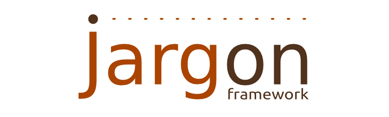

# Middleware for data management in REST style web applications with rich client.

Jargon framework is a Middleware aimed for Web Applications designed and implemented with Java Enterprise Edition 6 and ExtJS 4. It is a tool for building applications and offers mapping tools, transparent communication and transactional features. Jargon framework is in accordance with the JPA specification and is independent of the persistence implementation.

The features that Jargon offers are divided into three main sections. The Entity mapping and generation of the corresponding Models, the communication between the clients and the server and finally, the client-side transaction API.

The lifecycle of an application that embeds Jargon starts on deployment time where the annotation reader, the Jargon CDI extension, collects all the information about the Entities, through the framework’s annotation API. When this procedure finishes, initial configuration phase takes over and generates the Models and the structures that will keep the application up and running.

